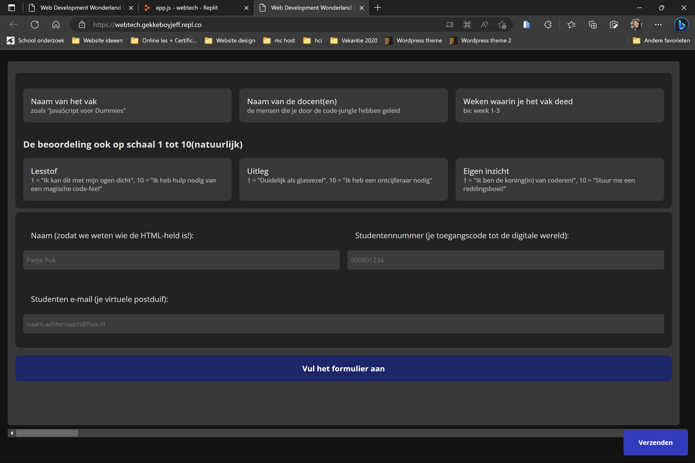
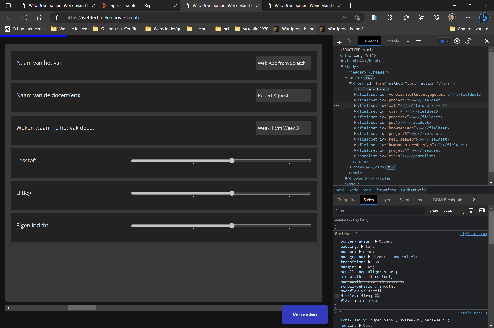
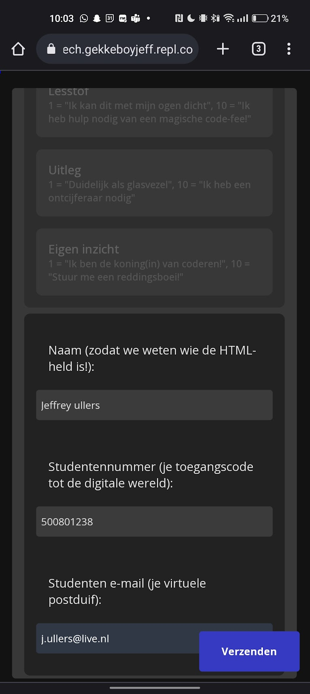
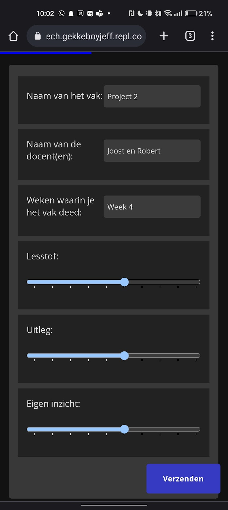
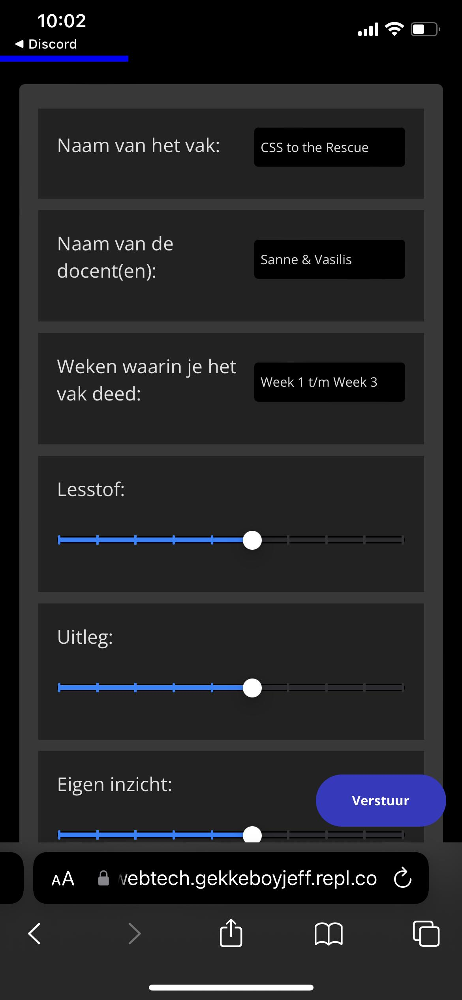
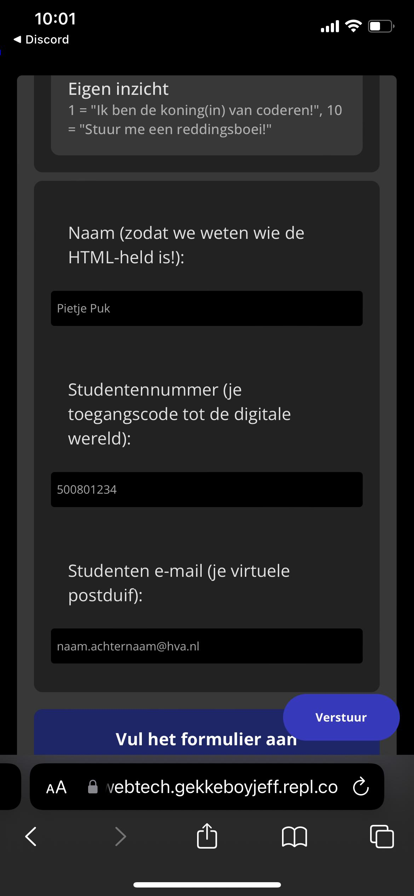
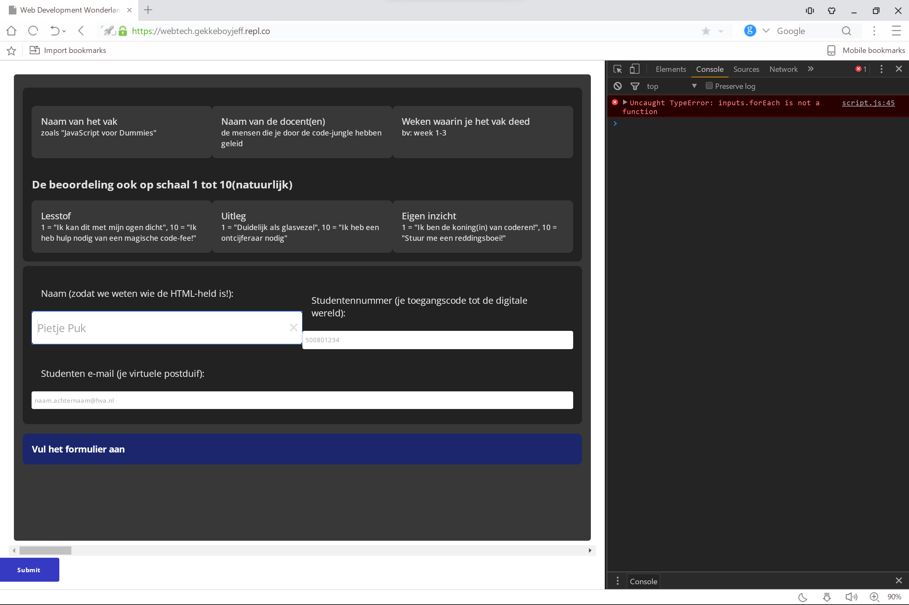
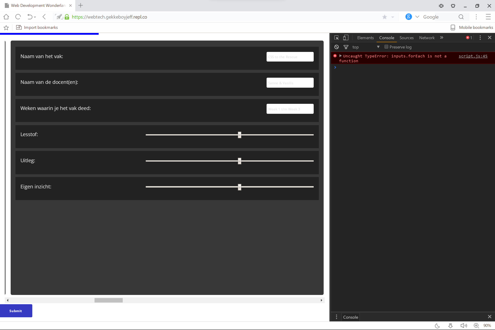
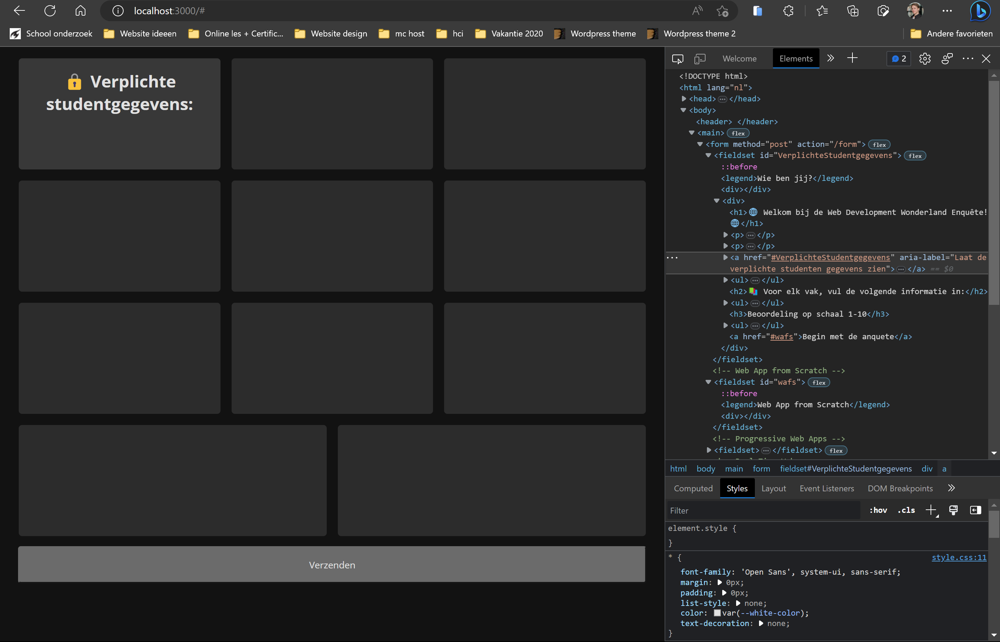
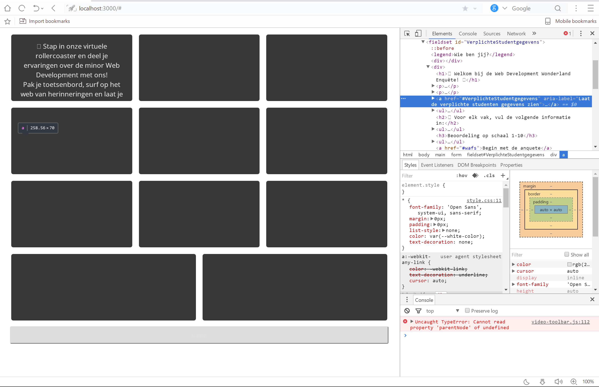

## Progressive Enhancement Opdracht: Een Toegankelijke Enquête

In een wereld waarin websites steeds complexer worden en technologieën zich razendsnel ontwikkelen, biedt progressive enhancement een manier om te zorgen voor toegankelijkheid voor iedereen, ongeacht hun browser of context. In dit verhaal volgen we een ontwerper die de principes van progressive enhancement toepast op een opdracht om een interactieve en toegankelijke enquête te maken.

### Use-Case: Enquête met Formulier Validatie

De ontwerper begint met het uitkiezen van een uitdagende use-case:

- Het maken van een enquête met verplichte velden voor studentgegevens, een beoordeling van de lesstof en docenten.
- Een formulier validatie die ervoor zorgt dat het formulier volledig en correct wordt ingevuld.
- De enquête moet ook een gebruiksvriendelijke interface hebben, met een duidelijke indicatie van de voortgang en de mogelijkheid om vragen over te slaan of terug te keren naar eerdere vragen.

### Afwerking en Testen

Om de opdracht af te ronden:

- Simuleer wat de server moet teruggeven als data.
- Kies een obscure browser om de enquête in te testen.
- Zorg ervoor dat de gekozen browser de enquête zo goed mogelijk kan verwerken en verdedig je keuze.

### Extra Uitdagingen

De ontwerper maakt de enquête nog interessanter door het toevoegen van:

- Light en dark mode opties.
- Gebruik van session storage om de gebruikerservaring te verbeteren.


---

Het doel van progressive enhancement is om ervoor te zorgen dat alle gebruikers toegang hebben tot de basisfunctionaliteit van een website of applicatie, ongeacht hun apparaat of browser. Tegelijkertijd biedt het een verbeterde ervaring voor gebruikers met geavanceerdere technologie, zonder de basiservaring voor anderen in gevaar te brengen. Ik heb uiteindelijk de site zo in elkaar gezet dat de basis prima werkt op verschillende browsers.

## Wireframe


## test resultaten

### Aanpassen van aria-labels voor inputvelden

Tijdens het testen van mijn website met een screenreader, ontdekte ik dat er geen aria-labels aanwezig waren op mijn inputvelden. Om de toegankelijkheid van de website te verbeteren, heb ik deze labels toegevoegd. Aria-labels zijn belangrijk omdat ze extra informatie bieden aan gebruikers van screenreaders, wat helpt bij het navigeren en begrijpen van de website.

#### Problemen met JavaScript in UC Browser

### Issues met querySelectorAll

Ik kwam erachter dat sommige JavaScript-functionaliteiten niet naar behoren werken in de UC Browser. Bijvoorbeeld, de querySelectorAll-functie functioneert niet zoals verwacht, wat resulteert in het niet herkennen van mijn inputs door JavaScript. Hierdoor ontbreken er parameters in de URL en kunnen deze niet worden ingeladen.

### Probleem met de voortgangsbalk

Een ander probleem dat ik tegenkwam in de UC Browser is een fout in de JavaScript-code, waardoor de voortgangsbalk niet werkt. Dit kan een negatieve invloed hebben op de gebruikerservaring en is iets dat ik in de toekomst wil oplossen.

### Kleurweergave problemen in UC Browser

Tijdens het testen merkte ik ook op dat de UC Browser niet automatisch kleuren invult zoals andere browsers dat doen. Dit leidt ertoe dat sommige kleuren ontbreken en daardoor doorzichtig zijn. Het is belangrijk om rekening te houden met deze kleurweergaveproblemen bij het ontwerpen van de website, zodat de inhoud toegankelijk blijft voor alle gebruikers, ongeacht de browser die ze gebruiken.

### Website op verschillende browsers
| Edge | Android | Ios | UC  |
| ---- | ------- | --- | --- |
|       |          |      |     |

## Veranderingen in de pagina-layout

Onlangs besloot ik om de lay-out van mijn webpagina grondig te herzien. Hierbij heb ik veel elementen en ontwerppatronen geëvalueerd om een efficiënte en aantrekkelijke gebruikersinterface te creëren. Tijdens dit proces heb ik rekening gehouden met de compatibiliteit van verschillende webbrowsers.

Bij het herontwerpen van mijn webpagina heb ik besloten om uiteindelijk geen gebruik te maken van de @support CSS-regel. Dit komt voornamelijk doordat de UC Browser bepaalde CSS-selectors, zoals :has en :not, niet ondersteunt.

Ik heb de website https://tests.caniuse.com/ gebruikt om te kijken wat de browser wel en niet ondersteund.

## Week 1

Terwijl ik aan deze webapplicatie werk, maak ik een enquêteformulier om feedback te verzamelen over de minor Web Development. Ik gebruik het Express.js framework en EJS (Embedded JavaScript) als view engine om de pagina's te renderen. De opdracht is gericht op progressive enhancement en omvat het creëren van een formulier.

In app.js importeer en configureer ik het Express-framework. Ik voeg de 'public' map toe om statische bestanden te serveren en voeg een middleware toe om het request body te verwerken. Vervolgens stel ik EJS in als view engine:

```js
import express from "express";
let app = express();

// Add public folder
app.use(express.static("public"));

// Middleware to parse the body of the request as JSON
app.use(express.urlencoded({ extended: true }));

// Add EJS as view engine
app.set("view engine", "ejs");
```

Ik definieer twee routes voor de applicatie. De root route ("/") die de index.ejs pagina rendert, en de "/form" route die een POST-verzoek verwerkt afkomstig van het ingevulde enquêteformulier:

```JS
app.get("/", (req, res) => {
  res.render("index");
});

app.post("/form", (req, res) => {
  let resData = {
    serverData: req.body,
  };

  console.log(resData);
  res.render("form", {resData});
});
```

In het index.ejs bestand bouw ik het enquêteformulier op. Het formulier bevat verplichte studentgegevens, zoals naam, studentennummer en e-mailadres. Daarnaast vraag ik informatie over de verschillende vakken binnen de minor, zoals de naam van het vak, de docenten en de weken waarin het vak gevolgd werd. Ook vraag ik de lesstof, uitleg en het eigen inzicht te beoordelen op een schaal van 1 tot 10:

```HTML
<form method="post" action="/form">
  <!-- Verplichte studentgegevens -->
  <fieldset id="VerplichteStudentgegevens">
    <!-- Inhoud hier -->
  </fieldset>

  <!-- Vakken binnen de minor -->
  <fieldset id="wafs">
    <legend>Web App from Scratch</legend>
    <!-- Inhoud hier -->
  </fieldset>

  <!-- Overige fieldsets voor elk vak -->
  <!-- ... -->

  <input type="submit">
</form>
```

Ik gebruik fieldsets en legends om de verschillende secties van het formulier te structureren. Na het invullen van het formulier kan de gebruiker op de "submit" knop klikken, waarna de ingevulde gegevens naar de server worden gestuurd via de "/form" route.

## Week 2
Tijdens het testen van mijn webpagina kwam ik erachter dat mijn obscure browser geen support biedt voor de :has selector en de :not selector. Dat is iets waar mijn applicatie op gebouwd was.

|  Edge   |   UC Browser  |
| --- | --- |
|     |     |

Hierdoor besloot ik mijn formulier anders aan te gaan pakken. Te versimpelen zelfs.


